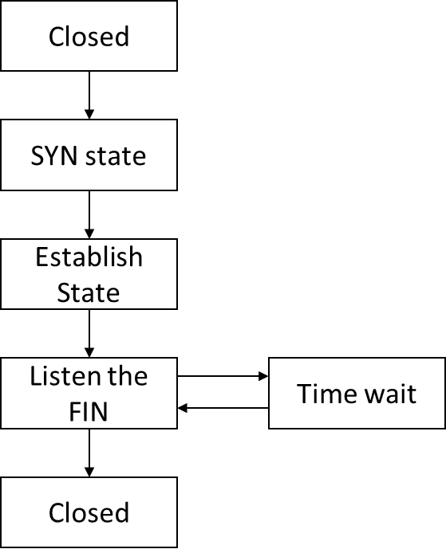
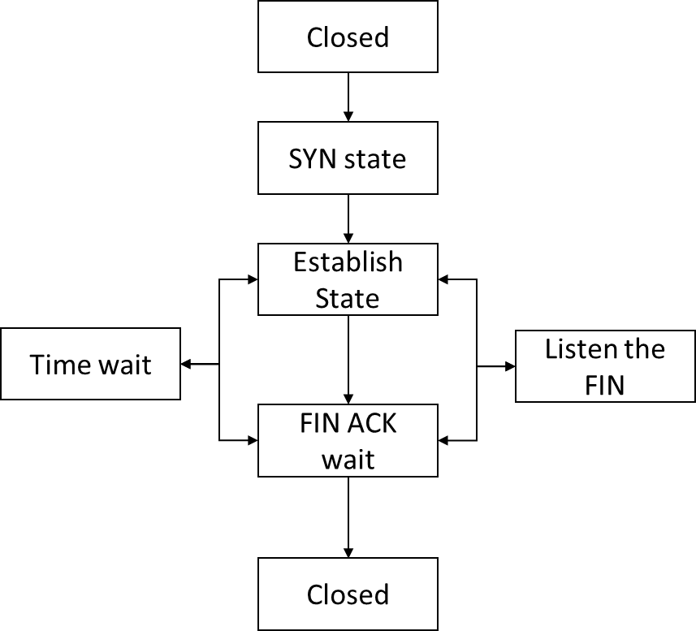

# 1. Overall program design

The program is based on Python 3 version 3.12.1 (Must higher than 3.6, since then `dict` becomes ordered in Python. That’s a feature used in the program)

Organization of the code like this:

```markdown
:.
│   readme.md
│
├───images
│       image-1.png
│       image.png
│
├───receiver
│       FileToReceive.txt
│       receiver.py
│       receiverSample.py
│       receiver_log.txt
│
└───sender
    │   sender.py
    │   senderSample.py
    │   sender_log.txt
    │
    └───sendFiles
            asyoulik.txt
            random1.txt
            random2.txt
```

The task of listener is much simpler than sender,  since listener is in a single thread (expect Time Wait state).  The sender need process much more jobs and it’s in a multithread.

Bellow is the process graph also the structure of my program.

## 1.1 Listener




## 1.2 Sender



# 2. Data structure design

The STP packet structure fellows the requirement and based on bytes

```markdown
+-------------+-------------+-------------+
|              Byte Offset                |
+------+------+-------------+-------------+
|   0  |   1  |   2  |   3  |   4  | MSS  |
+------+------+-------------+-------------+
|    type     |     seqno   |     data    |
+-------------+-------------+-------------+
```

In this program I also used the `dataclass` designed a self class `Control` .

It stores the input system input arguments 

There name and type look like this (receiver’s is similar)  → →

```python
@dataclass
class Control:
    """Control block: parameters for the sender program."""
    receiver_port: int
    sender_port: int
    txt_file_received: str
    max_win: int         
    is_alive: bool = True
    ori_data_recv: int = 0; ori_seg_recv: int = 0
    dup_seg_recv: int = 0; dup_seg_snd: int = 0
```

Importantly, I use a `window: dict` to main the packet that sender / receiver that hold on at a moment. It key and value `key (ACK seqno): value (packet type: STP packet)`

And `remainWin: int` to calculate the remain STP packet size that window can hold on at a moment.

Since `dictionary` is stored orderly in Python (Only after 3.6! before is unordered). Thus we can use `next(iter(window))` to find the oldest unacknowledged packet of the window.

# 3. Operation of the sender and receiver

## 3.1 Receiver

Operation of receiver is simple.  It need receive packets and reply every normal packets that received from sender, and these packets’ information into the receiver log.

While receive a packet the receiver will check if this is the next expect ordered packet

- Buffer it to `window` if not acknowledged
    - Read the next expected packet in the window and update if it existed.
- Ignored if the packet already acknowledged

Then reply the expected next packet

While received the `FIN` packet, the receiver will start a timer to count down 2 seconds and then close connection and exist.

## 3.2 Sender

The sender will emulate TCP to build a connection with receiver first.

While in the established & finish state the sender will active two child thread, one for listening the receiver’s ACK packets, one timer to count down the oldest packet.

When sender going to send a packet it will check the left size of `remainWin`

- If the packet is able to send then sender will record it in the `window` and reduce the `remainWin` , also start a new timer for the oldest packets.
- If the packet is unable to be load into the `window` the sender will wait until the window be released.

Timer thread will send the oldest packets every `rto` milliseconds.  It ends by listening thread or main thread.

The listening thread start at established state and finish after receive the FIN, ACK.  Upon received a packet it will do follows:

Emulate it dropped or not, then record it to the sender log. If not dropped then:

- Received packets and remove out prior packets in `window` and recover the `remainWin`. if received packet’s ACK number larger than the oldest packet’s received packet’s ACK number in the `window`
- Count the sequence number, if a sequence number appear more than 3 times then resend the oldest packet in the window.
- If received an ACK which correspond type is FIN, then stop listen thread

# 4. Design trade-offs considered and made

Originally I want simply to `<, >, <=` to check check the upcoming packets’ relation with the oldest packets in the window.  But I found it’s circled from 0 to 65535. Hence I use a way like this $seqno - next(iter(window))+ 65536) \% 65536 <= control.max\_win$ to judege.

For example if the upcoming `seqno` is on the left of the oldest packet, then the result will be near 65536, far large than `max_win`

The another trade-off is in receiver, I considered to use single thread to process all the life time of receiver.  However, it will stocked at Time wait state.  Therefore, I use a new thread timer to countdown 2*MSL, then modify a global variable to finish the program.